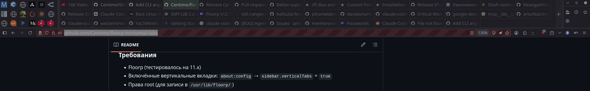

# Floorp Horizontal Tabs

A [Floorp](https://floorp.app/) browser (Firefox fork) customization that transforms the vertical sidebar tab panel into a horizontal multi-row tab grid above the address bar.




[Документация на русском / Russian documentation](README.ru.md)

## What it does

Floorp displays tabs vertically in a sidebar by default. This customization:

- Moves the tab panel above the address bar
- Arranges regular tabs in a **3 rows × N columns** grid (column count adapts to window width)
- Arranges pinned tabs in a separate icon-only grid on the left
- Relocates sidebar buttons (extensions, history, etc.) to the right side of the tab panel
- Adds drag-and-drop tab reordering within the grid

## Installation variants

The project contains two variants with different loading mechanisms:

| | Variant 1 (profile) | Variant 2 (system) |
|---|---|---|
| **Directory** | `variant-1-profile/` | `variant-2-system/` |
| **Install location** | User profile (`~/.floorp/*/chrome/`) | System directory (`/usr/lib/floorp/`) |
| **CSS loading** | `nsIStyleSheetService` (AGENT_SHEET) | File read + `<style>` injection |
| **JS loading** | `Services.scriptloader.loadSubScript` | Embedded in `autoconfig.cfg` |
| **Grid** | Fixed (6 columns × 3 rows) | Adaptive (`auto-fill`) |
| **Status** | Legacy, unmaintained | **Active** |

**Variant-2-system is recommended** — it contains all the latest fixes.

Root-level files (`horizontal_tabs.js`, `horizontal_tabs.css`, `autoconfig.cfg`, `autoconfig.js`) are copies of variant-1, kept for history.

## Installation (variant-2-system)

### Requirements

- Floorp (tested on 11.x)
- Vertical tabs enabled: `about:config` → `sidebar.verticalTabs` = `true`
- Root access (to write to `/usr/lib/floorp/`)

### Automated deploy

```bash
sudo bash deploy-variant-2.sh
```

The script copies three files to `/usr/lib/floorp/`:

| Source file | Destination |
|---|---|
| `variant-2-system/autoconfig.js` | `/usr/lib/floorp/defaults/pref/autoconfig.js` |
| `variant-2-system/autoconfig.cfg` | `/usr/lib/floorp/autoconfig.cfg` |
| `variant-2-system/horizontal_tabs.css` | `/usr/lib/floorp/horizontal_tabs.css` |

### Manual installation

1. Copy `autoconfig.js` to `<floorp>/defaults/pref/`
2. Copy `autoconfig.cfg` and `horizontal_tabs.css` to `<floorp>/`
3. Ensure file permissions are `644`
4. Restart Floorp

### Uninstall

Remove the three files from `/usr/lib/floorp/` and restart the browser:

```bash
sudo rm /usr/lib/floorp/autoconfig.cfg
sudo rm /usr/lib/floorp/horizontal_tabs.css
sudo rm /usr/lib/floorp/defaults/pref/autoconfig.js
```

## Configuration

CSS variables in `horizontal_tabs.css` (`:root` section):

| Variable | Default | Description |
|---|---|---|
| `--htabs-panel-height` | `120px` | Total tab panel height |
| `--htabs-tab-width` | `150px` | Regular tab width |
| `--htabs-tab-height` | `40px` | Regular tab height |
| `--htabs-pinned-cell` | `40px` | Pinned tab cell size |
| `--htabs-pinned-icon` | `28px` | Pinned tab icon size |
| `--htabs-selected` | `rgba(100, 140, 110, 0.30)` | Selected tab background |
| `--htabs-hover` | `rgba(180, 170, 100, 0.20)` | Hover background |
| `--htabs-border` | `rgba(128, 128, 128, 0.3)` | Tab border color |
| `--htabs-border-accent` | `rgba(128, 128, 128, 0.5)` | Accent separator color |

## Limitations

- **Tab limit** — the "+" button is hidden when the grid is full (3 rows × N columns depending on window width). New tabs can still be opened via Ctrl+T or context menu.
- **Tied to Floorp/Firefox internals** — the code monkey-patches internal objects (`tabDragAndDrop`) and accesses internal DOM elements (`#tabbrowser-tabs`, `#pinned-tabs-container`, Shadow DOM). Floorp updates may break the customization.
- **Linux only** — the deploy script targets `/usr/lib/floorp/`. Paths differ on other OSes.
- **Requires `sidebar.verticalTabs = true`** — if the setting is off, the script does not initialize (feature detection). This is by design: the customization transforms vertical tabs into horizontal ones.
- **Drag-and-drop** — works for single tabs. Multi-select tab dragging is not fully supported.
- **Not a plugin** — the WebExtensions API does not provide access to the browser's XUL DOM, making an extension-based implementation impossible.

## Diagnostics

The script writes diagnostic flags to `about:config` on startup:

| Key | Value | Description |
|---|---|---|
| `htabs.diag.1_start` | `true` | autoconfig.cfg started execution |
| `htabs.diag.2_css_read` | `true` | CSS file read successfully |
| `htabs.diag.2_css_missing` | `true` | CSS file not found |
| `htabs.diag.3_observer` | `true` | Window observer registered |
| `htabs.diag.4_verticalTabs_enabled` | `true` | `sidebar.verticalTabs = true`, initialization started |
| `htabs.diag.4_verticalTabs_disabled` | `true` | `sidebar.verticalTabs = false`, initialization skipped |
| `htabs.diag.5_init_done` | `true` | All modules executed |

Module errors are logged to the Browser Console (`Ctrl+Shift+J`) with the `htabs` prefix.

## Project structure

```
floorp-horizontal-tabs/
├── README.md                    # This file
├── README.ru.md                 # Russian documentation
├── ARCHITECTURE.md              # Technical architecture
├── ARCHITECTURE.ru.md           # Technical architecture (Russian)
├── deploy-variant-2.sh          # Deploy script
├── docs/
│   └── screenshot.png           # Screenshot
├── variant-2-system/            # Active variant
│   ├── autoconfig.js            # Pointer to autoconfig.cfg
│   ├── autoconfig.cfg           # JS: modules, orchestrator, DnD
│   └── horizontal_tabs.css      # CSS: grid, tab styles
├── variant-1-profile/           # Legacy variant (profile-based)
│   ├── autoconfig.cfg
│   ├── autoconfig.js
│   ├── horizontal_tabs.js
│   └── horizontal_tabs.css
├── horizontal_tabs.js           # Copy of variant-1 (legacy)
├── horizontal_tabs.css          # Copy of variant-1 (legacy)
├── autoconfig.cfg               # Copy of variant-1 (legacy)
└── autoconfig.js                # Copy of variant-1 (legacy)
```
